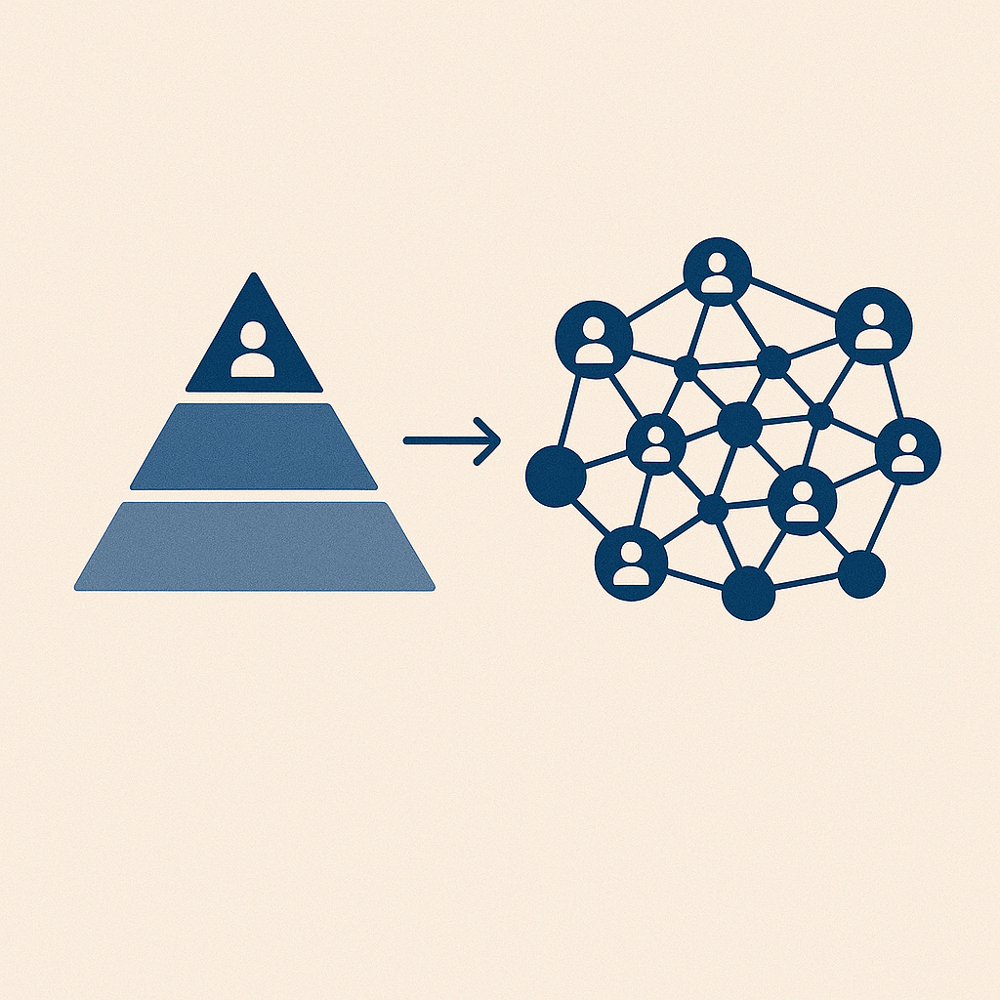

Imagine halving your programme development time with AI only to realise the entire operation hinges on a single motivated employee who could walk out the door tomorrow. 

<!-- excerpt -->

One corporate training company I spoke to recently faced exactly this dilemma. Their impressive AI success created an unexpected vulnerability.

Their AI-secret wasn't a complex strategy, but a single curious employee who, through trial and error, figured out how to combine LLMs with their deep industry knowledge building well-crafted prompts and applying them throughout their business. AI was used to streamline everything from client discovery, content creation through to quality assurance.

Sounds great, right?

But these efficiencies hide a big vulnerability: that their business is one resignation away from AI disaster.

This isn't just hypothetical. The problem became clear during one of the team's post-training analysis calls. The AI expert would usually generate detailed analysis reports right after a training session - giving clients immediate, actionable feedback to discuss during the call. When their AI specialist was unexpectedly absent, there was no one able to step in and generate the reports. The team didn't understand how to use the tools, leaving them floundering on the call risking reputation.

This scenario highlights an emerging risk that many businesses adopting AI face. The tool that gives companies a competitive edge can also represent their biggest vulnerability. While everyone rushes to implement AI faster, sustainable implementation is often overlooked.

## The Hidden Vulnerability in Your AI Strategy

This pattern repeats across industries. For smaller companies and non-tech organisations, where formal AI training programmes don't exist, success increasingly relies on what we might call "AI pioneers" - those who take initiative to explore and implement AI solutions.

These pioneers, often through hours of persistence and experimentation, disrupt established workflows often for the better. The systems they build are often brilliant, but their knowledge remains largely undocumented and unshared.

While AI success stories are celebrated across industries, the vulnerability they create remains largely undiscussed. Consider these increasingly common scenarios:

- Marketing teams with sophisticated prompt libraries but no documentation of techniques
- Operations departments with streamlined AI workflows known only to their creator
- Customer service systems built on complex LLM knowledge that lives in a single person's head

In each case, if the AI pioneer leaves, the team is left scrambling. The competitive edge built on their AI skills disappears overnight. This isn't just a people problem – it's a fundamental business risk tied directly to their AI adoption.

## Building an AI Knowledge Mesh

There is a better way.

AI resilience requires distributing knowledge across the organisation. Rather than concentrating expertise in a few individuals, forward-thinking companies are creating knowledge networks that capture these learnings systematically.

Organisations who successfully distribute their AI knowledge and expertise, experience numerous benefits:

- Higher overall productivity and efficiency
- Increased talent retention and knowledge preservation
- Greater resilience to disruption
- Reduced operational risks

This transformation shifts AI knowledge from a pyramid structure (with expertise concentrated in single individuals) into a mesh - where knowledge, including the valuable lessons from trial and error are shared, documented, and accessible to everyone who needs it.

## Transforming Vulnerability into Strength

The following represents a three-step process to transform this AI vulnerability into organisational strength:

### 1. Audit & Document
**Purpose:** Create a comprehensive map of your AI operations to understand where knowledge currently resides and capture the experimental journey.

**Actions**

- Identify and map high-level workflows including current AI touchpoints
- Create a company "AI Playbook" that includes a central library of effective prompts, documenting both successful approaches and failed experiments
- Record video walkthroughs of common AI tasks, including troubleshooting techniques

### 2. Share Knowledge & Train
**Purpose:** Transform siloed expertise into collective knowledge through structured learning and practice.

**Actions**

- Organise bi-weekly "AI Skill Share" sessions where pioneers demonstrate their processes
- Establish mentor-mentee pairs for hands-on learning
- Rotate AI responsibilities among team members to build practical experience

### 3. Implement & Maintain
**Purpose:** Build resilience into your AI operations through redundancy and contingency planning.

**Actions**

- Ensure multiple team members are trained to run each critical AI process
- Develop offline alternatives for critical workflows
- Establish emergency response procedures

Crucially, this isn't a one-time checklist but an ongoing cycle. Regularly revisit each phase to adapt to new tools, evolving processes, and changing team knowledge.

---

## Building AI Resilience

Having AI initiatives dependent on a few key people is a common challenge, but one you can overcome. 

I help businesses transform fragile AI dependency into robust, organisation-wide capability, addressing challenges such as:

- **Identify hidden risks:** Uncover exactly where your critical AI knowledge gaps and dependencies lie.
- **Develop a clear roadmap:** Create a practical, tailored plan to distribute expertise and build shared understanding.
- **Implement sustainable practices:** Embed proven strategies for documentation, training, and ongoing knowledge sharing.

If the above sounds like something you could benefit from, feel free to schedule a free call to discuss.

<a href="https://cal.com/quantably/30min" target="_blank" className="book-call-button">Book a call here</a>

Remember: Sustainable AI implementation is the key to long-term success.
