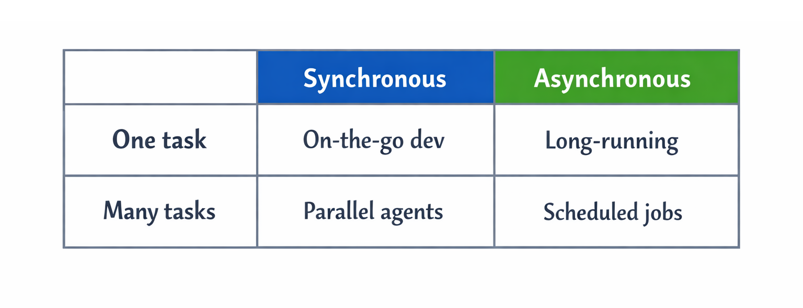

Last week I shipped four features and wrote almost no code. I reviewed a PR from my phone on a train. <!-- excerpt -->

If you're babysitting every Claude Code session from your laptop, you're missing the point.

## The Shift

Coding agents got good. Claude Code can plan, execute, and iterate until objectives are met. It works for hours without supervision if you give it clear direction.

My job now:

- Define tasks with success criteria
- Spin up agents and point them at problems
- Review and merge their work
- Handle the parts that need human judgement

Here's how I've set things up.


## The Framework

My setup breaks down into four areas:

<div style="text-align: center">



</div>

Each solves a different problem. Together, they let me ship more while doing less manual coding.

---

## 1. On-the-Go Development

With agents doing more autonomously, it often doesn't make sense to sit and wait for them to solve an issue. The idea isn't to be constantly working, but to check in and make key decisions from wherever you are, rather than being chained to a desk.

The central tenet of this approach is shifting from developing on a local laptop to having a server as your centralised development environment. That way it can be accessed from multiple devices and configured to support low bandwidth environments.

When I first tried this, I used SSH to connect to Claude on remote terminals - it worked great on WiFi. But switching to mobile internet meant dropped connections. The breakthrough was finding a stack that survives patchy connectivity - trains, planes, coffee shops - reconnecting automatically without losing state.

My approach is largely derived from <a href="https://granda.org/en/2026/01/02/claude-code-on-the-go/" target="_blank">Jorge Granda's excellent post</a>, which details a secure, mobile-friendly Claude workflow.

**The stack:**
- **Tailscale** - Private mesh VPN. Server invisible to the internet.
- **mosh** - Mobile shell. Survives WiFi → 4G switches and patchy connections. Since Claude runs on the server, it always has good bandwidth - only text output comes back to your device.
- **tmux** - Terminal multiplexer. Sessions persist when disconnected. Stop on laptop, pick up on phone from exactly where you left off.

```bash
alias dev='mosh user@100.x.x.x -- tmux new-session -A -D -s main'
```

For the full setup guide (server config, security hardening, Tailscale setup), see Granda's post linked above.

**My mobile setup:**
- **Termius** - My mobile terminal of choice. Supports mosh.
- **Wispr Flow** - Voice transcription. I use this on desktop too, but it's especially useful on mobile where typing into a terminal is tedious. Dictate your prompt, paste, done.

**Quirks:**

- **Screen resolution** - When connecting from different devices, resolutions can clash. The `-D` flag solves this - it detaches other clients when you connect, so the terminal resizes to your current device.
- **Scrolling** - On mobile, scrolling previous conversations can work weirdly. Use `Ctrl-b [` then pg up to scrollback through messages.

---

## 2. Scheduled Jobs

Some tasks should happen regularly without me asking - code reviews, progress summaries, dependency audits. Of course you can schedule scripts with cron, but the point is I don't want to figure out cron syntax. More importantly, it's not just about running scripts - it's about chaining calls together and having Claude summarise results into something useful, then send it to Slack, email, or just a markdown file on the server.

**When to use this:** Any task you want to run regularly. Check yesterday's commits for security issues. Write a daily progress summary from commit history. Run the full test suite every week.

I use <a href="https://github.com/jshchnz/claude-code-scheduler" target="_blank">claude-code-scheduler</a> for this. It's a plugin that installs with two lines:

```bash
/plugin marketplace add jshchnz/claude-code-scheduler
/plugin install scheduler
```

Then you just tell Claude what you want scheduled in natural language.

**Examples:**

*Daily code review (weekdays at 9am):*
> Schedule every weekday at 9am: review commits from the last 24 hours, check for bugs, security issues, and missing error handling

*Progress summary (daily at 6pm):*
> Daily at 6pm: summarise today's commits and key decisions to ~/progress/$(date +%Y-%m-%d).md

*Tech debt tracking (weekly):*
> Every Monday at 10am: scan the codebase for TODO comments, deprecated dependencies, and functions over 100 lines. Write a tech debt report to ~/reports/tech-debt.md

The scheduler uses crontab under the hood. Tasks run even when you're not there.

---

## 3. Long-Running Tasks

Some tasks take hours but are well-defined: implementing a feature with tests, large refactors, TDD loops. In these cases I don't want to babysit. I want Claude to keep iterating until the objective is met - not pause for approval at every unit test or subtask. The goals are clear; it should just keep going until it's done.

This isn't appropriate for everything, but it works well for "turn the handle" tasks that need iteration.

**The solution:** The <a href="https://awesomeclaude.ai/ralph-wiggum" target="_blank">Ralph Wiggum plugin</a> - a persistent loop that keeps Claude working until completion.

```bash
/ralph-loop:ralph-loop "implement user auth with tests" --max-iterations 50
```

Claude keeps iterating - write code, run tests, fix failures, repeat - until completion or the iteration cap.

**Best for:**
- Overnight feature implementation
- TDD loops (test → implement → refine)
- Large refactors with clear success criteria

Stop it anytime with `/ralph-loop:cancel-ralph`.

---

## 4. Parallel Agents

I have three features to ship. Traditional solo dev workflows suggest working on them sequentially. But with agents doing the implementation, why not run them in parallel?

Git worktrees let each agent work on an isolated branch with its own working directory. Tmux windows let me switch between them instantly. One agent is adding auth, another is building the API, a third is writing tests - all running simultaneously without stepping on each other.

**The solution:** Git worktrees + tmux windows.

```bash
# Create isolated worktrees
git worktree add ../feat-auth feature/auth
git worktree add ../feat-api feature/api

# Launch agents in separate tmux windows
Ctrl-b c              # new window
cd ../feat-auth && claude

Ctrl-b c              # another window
cd ../feat-api && claude

# Switch between them
Ctrl-b n    # next
Ctrl-b p    # previous
```

Each agent has its own context, its own branch, its own working directory. They don't interfere with each other.

---

## Security Note

Running Claude on a remote server is safer than running it locally. If something goes wrong, the damage is limited to one server - not your laptop with all your credentials and personal files.

The servers are invisible to the public internet:

- **Tailscale** - Private mesh network, no public IP
- **UFW** - Firewall allowing only Tailscale traffic

No exposed ports, no attack surface.

---

## Resources

- <a href="https://granda.org/en/2026/01/02/claude-code-on-the-go/" target="_blank">Claude Code on the Go</a> - Detailed mosh/tmux/Tailscale setup
- <a href="https://github.com/jshchnz/claude-code-scheduler" target="_blank">claude-code-scheduler</a> - Scheduling plugin
- <a href="https://awesomeclaude.ai/ralph-wiggum" target="_blank">Ralph Wiggum</a> - Long-running task loops
- <a href="https://termius.com" target="_blank">Termius</a> - Mobile terminal with mosh support
- <a href="https://wispr.flow" target="_blank">Wispr Flow</a> - Voice transcription for mobile

---

Pick the quadrant that solves your biggest problem. For most, that's on-the-go development. The rest follows.
