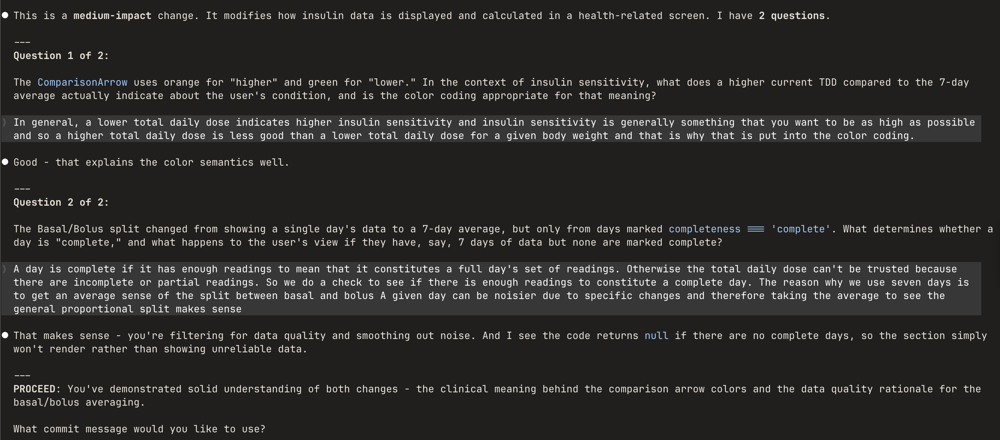

Two things are happening as coding agents improve. First, the sheer volume and speed of AI-generated changes makes it hard to care about each one individually. Second - and more concerning - my capacity for judgement feels like it's slowly eroding.

The standard advice is clear:

> you should be able to explain any production code that's committed, even if it was written by an agent.

I know that. I just can't motivate myself to.

It's hard to care as much about code I didn't write much of - especially when it's also far easier to generate than before.

The feedback loop I'm seeing play out looks as follows: 

AI provides code → human feels relief (problem solved, uncertainty gone) → outcome is acceptable → questioning feels like unnecessary effort → human defers more readily next time → judgement atrophies

Sure, I still have eureka moments where I catch something the AI missed. But those wins are trending down. Not hard down, but down.

I think we need to be concerned with this, and it represents an overlooked risk in the extinction scenarios that dominate the AI safety discourse. What if the AI gets out of control, not because of its super human intelligence but because we simply stopped exercising our judgement over it. The riskiest part is that if this happens gradually enough we might not even notice.

## This isn't just me

Humans in general have a tendency to over-rely on automated recommendations. It's called automation bias which can give rise to two types of errors: 

1. Over-reliance on automated recommendations even when contradictory information exists
2. Failing to act when the automation doesn't provide a recommendation

Both of these apply to AI-assisted coding. We accept generated code even when our instincts suggest problems. We fail to act when AI doesn't flag something.

The well cited example that showcases both of these errors was [Air France 447](https://en.wikipedia.org/wiki/Air_France_Flight_447) which crashed in 2009. The automation disengaged and the pilots, unaccustomed to flying manually at that altitude, were unable to recover.

## The inversion

The idea came to me whilst using an LLM to interrogate a podcast transcript. I'd ask follow-up questions to crystallise my understanding - but the verbosity made it hard to take in.

So I tried something different. After my questions, I asked the AI to quiz me instead - identify gaps in my understanding. It worked remarkably well. Not just ingraining new ideas, but highlighting where I was still missing clarity.

It turns out a research group already did this with students. <a href="https://solve.mit.edu/solutions/90692" target="_blank">Socratic Mind</a> had students use an LLM to learn, then get quizzed until the AI was satisfied they understood. More effort, but unsurprisingly, much better long-term recall.

## Applying this to code

My next idea was whether the same approach could be applied to coding. A pre-commit hook seemed like the obvious mechanism, but that's awkward to wire up to an interactive LLM session. Instead, I built it as a Claude Code skill - when I'm ready to commit, I invoke it, get quizzed, and it only commits if I pass.

The obvious objection is that this adds friction. But friction already exists - it just shows up later, when something breaks and I realise I never understood why the code was shaped that way. The models being right more often makes this worse, not better. Success breeds complacency.

## What makes a good question

The goal is to expose gaps between what code does and why it's shaped that way. A bad question can be answered by reading the code back - "what does this function do?" proves nothing. A good question forces engagement with trade-offs. "Why a map here instead of a for loop?" - I either thought about that or I didn't. No way to fake it.
The categories that matter:

- The problem - Not just "add rate limiting" but why it's needed here, what it's protecting against
- The key decisions - Where were there choices? What drove them? This is where AI-generated code is most dangerous - choices were made, but not by you
- The boundaries - What this code handles and what it explicitly doesn't
- The failure behaviour - Not every edge case, but the general character. Silently? Loudly? Gracefully?

These are also the things that matter for maintenance. Knowing what code does tells you what IS happening. Why it's shaped that way tells you what SHOULD be happening - which is how you spot when something's wrong.

## The transition period

Right now, AI-generated code is good but not reliable enough for full autonomy. Despite the narrative that you describe requirements and watch it get built, SWEs are still required for anything non-trivial. Maybe a day comes where they're not - we don't require understanding of combustion engines to drive a car.
But we're not there yet. Humans are still legally and professionally responsible. Someone needs to understand when things go wrong. And AI explanations of AI-generated code may be just as unreliable as the code itself.
Things are moving quickly. But right now, maintaining judgement might be the difference between catching something wrong or missing it entirely.

## Try it yourself

The skill works as a drop-in replacement for `git commit -m`, and scales questioning to the magnitude of the change - a one-line fix doesn't need five questions.

### Step 1: Create the skill file

Create a file at .claude/skills/socratic-commit-review.md in your repo (or ~/.claude/skills/ for global use) and insert the skill from <a href="https://gist.github.com/quantably/a96478ebd4791ba8b215171502e0776a" target="_blank">this gist</a>.

### Step 2: When you're ready to commit

Instead of git commit -m, run /socratic-commit-review. Claude asks questions about your changes, then marks you PROCEED or REFLECT. Proceed prompts for a commit message and commits. Reflect suggests areas where your understanding was shaky.

Here's an example interaction on a health app I'm working on:

## Closing Thoughts

Getting quizzed cements why something was implemented a certain way. More surprisingly, it surfaces bugs - mismatches between what I thought I'd asked for and what the AI generated. Those only become visible when you're forced to explain the implementation back. Even when there are no bugs, thinking through the code surfaces simpler approaches I'd have otherwise missed. 

The friction is the point.

