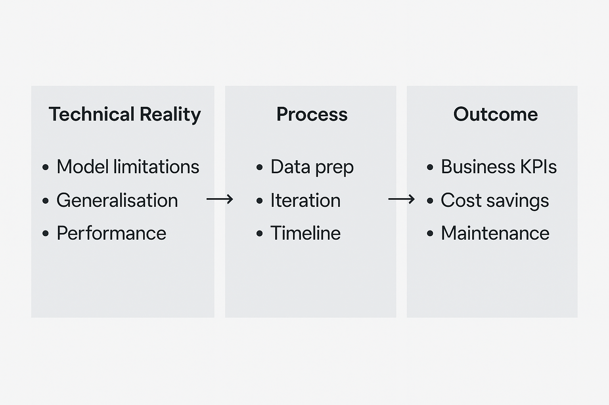
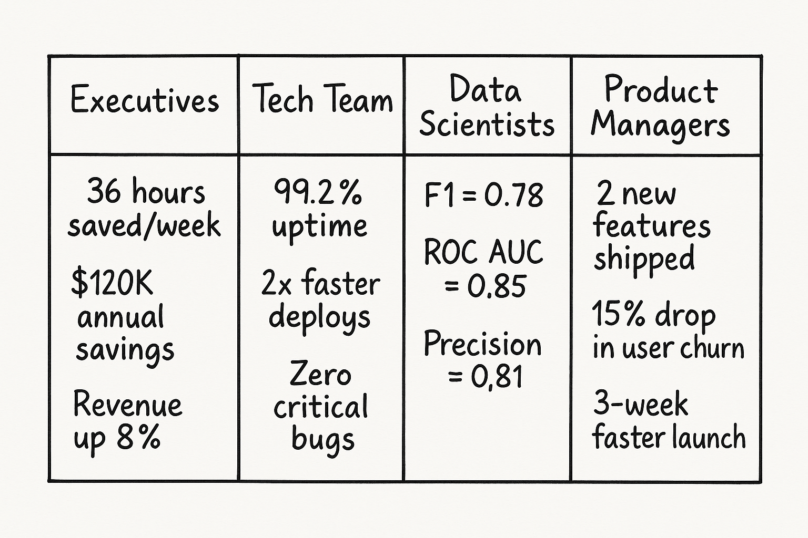

The most successful AI projects I've led share a common trait. It's not superior technology or bigger budgets. It's a discipline that most companies overlook entirely: expectation setting.
<!-- excerpt -->

AI involves many disciplines: technical expertise, domain knowledge, infrastructure etc. These all matter. But when they're in place, expectation setting is often _the_ determining factor.

## Why AI Demands a New Approach

Setting expectations isn't a new idea, but it's especially critical in AI. Three key factors make it challenging:

##### 1. The Hype Factor 
- AI projects suffer from mismatched expectations more than other tech areas
- Media coverage creates unrealistic benchmarks

##### 2. Hidden Complexity 
- It's not always clear what AI can actually do (and what it can't)
- 'Hidden' work behind the scenes isn't obvious to stakeholders
- Example: Customers confused when data preparation is allocated a month

##### 3. Non-linear Progress 
- Traditional roadmaps promise features by set dates, but AI progress isn't linear
- You might reach 60% accuracy quickly, then spend months chasing 85%
- This affects both internal teams and external stakeholder expectations

## The Three Layers Where AI Expectations Typically Fail
These challenges are why I've found it helpful to structure commonly missed AI expectation management across three categories:

1. Technical Reality Expectations
2. Process Expectations
3. Outcome Expectations

### Layer 1: Technical Reality Expectations
This layer addresses misalignments in understanding AI's capabilities. Stakeholders must grasp what the technology can realistically do, and critically, what it can't.

A key learning for me: I once had a client who was baffled when a model couldn't predict accurately on new data. They didn't understand the model's limits - how it struggles to generalise beyond what its seen in training. That wasn't just a technical detail. It nearly derailed the whole project.

Another common issue? Judging a model by a few cherry-picked bad predictions. It's smart to investigate failures, but that shouldn't define overall performance. Still, I see customers fixate on these outliers again and again.

### Layer 2: Process Expectations
Process expectation setting is about aligning on AI project workflows. Stakeholders often express surprise at the data exploration timeline. They're eager for outcomes but are not always aware of the steps needed to get there.

The cyclical nature of AI development is another area often needing alignment. AI projects rarely fit linear GANTT charts. Instead, they iterate: BUILD -> MEASURE -> LEARN feedback loops. This refines model performance through rapid experimentation, where many experiments can and should "fail".

These aren't actually failures, but learning opportunities. Without careful expectation management however, these efforts risk being perceived as a lack of progress.

### Layer 3: Outcome Expectations
Communicating AI project results demands a tailored approach. Internal or external, the audience dictates the level of detail and language used.

I've witnessed first hand executives visibly disengage as detailed F1-scores for a multi-class classifier were presented. The communication wasn't audience-appropriate. Execs and capital allocators need technical KPIs translated into business outcomes or cost savings to speak their language.

Model maintenance is another frequent point of misalignment related to outcomes. AI systems are rarely "fire and forget." Data distributions drift, requiring maintenance in the form of monitoring and periodic model retraining or refreshing the data.

### Revolutionary Approaches for the AI Era

Recognising these three layers reveals common pain points. Despite this, traditional approaches to expectation management often perpetuate the problems they attempt to solve. Below are four approaches I use that directly address these challenges.

##### 1. Create dual reporting structures

Dual reporting means sharing technical metrics with teams and business outcomes with leadership. Remember the executive who disengaged during F1-score discussions (Layer 3)? Same project, different languages. The key is tailoring results to the audience - what matters to one group may be irrelevant to another.

##### 2. Frame expectations through cost of omission rather than the benefits of inclusion

When clients question the month allocated for data preparation (Layer 2). Instead of defending the timeline, flip the conversation and help explore what happens without data preparation work. Raise the question: "What's the cost of NOT doing this step?" Frame it in terms of outcomes the stakeholder is primarily concerned with - predictive accuracy, frauds detected, chatbot hallucinations. This is not about being negative, it's about transparency and clarity on the importance of certain parts of a project.

##### 3. Create a failure library documenting every dead end, flawed assumption or failed experiment 

For stakeholders who view AI iteration as failure (Layer 2), a failure library reframes setbacks as assets. When teams document what didn't work, "failure" becomes intelligence.
This compounds as new people join. Instead of repeating dead ends, they see what's been tried. Smart teams track failures, not just wins. Document every wrong turn.

##### 4. Set expectations for a mental shift, not just the deliverables

The root of stakeholder confusion about AI (Layer 1) isn't just a lack of knowledge. The real gap is behavioural - putting knowledge into practice.

It's like running a marathon. You can read about running mechanics, buy carbon-plated shoes, and purchase a training plan. That part's easy. But it doesn't mean you'll lace up in the rain and run 10 miles in the depth of winter. 

AI adoption is the same.

The challenge isn't just understanding what AI can do. It's the mindset shift to avoid obsessing over edge cases when two predictions go wrong and instead consider the overarching performance of the system.

How can AI leaders help? Don't cram teams with generic AI courses. Give them frameworks they can actually use. Use concrete language and analogies that connect AI to business realities. Bridge the gap with shared experiences. Instead of lectures, run sessions where teams experiment together with simple AI tools.

## Conclusion

Expectation setting isn't just a project management checkbox - it's often the difference between AI that delivers and AI that doesn't. The best leaders don't just manage timelines; they manage mindsets.

Start by mapping out the three layers: technical reality, process, and outcomes. Spot where expectations are most misaligned. Use dual reporting, frame the cost of skipping steps, document failures, and focus on mindset shifts.

You don't need to be perfect. You just need to be clear, honest, and willing to adapt. In AI, progress comes from learning and doubling down on what works.