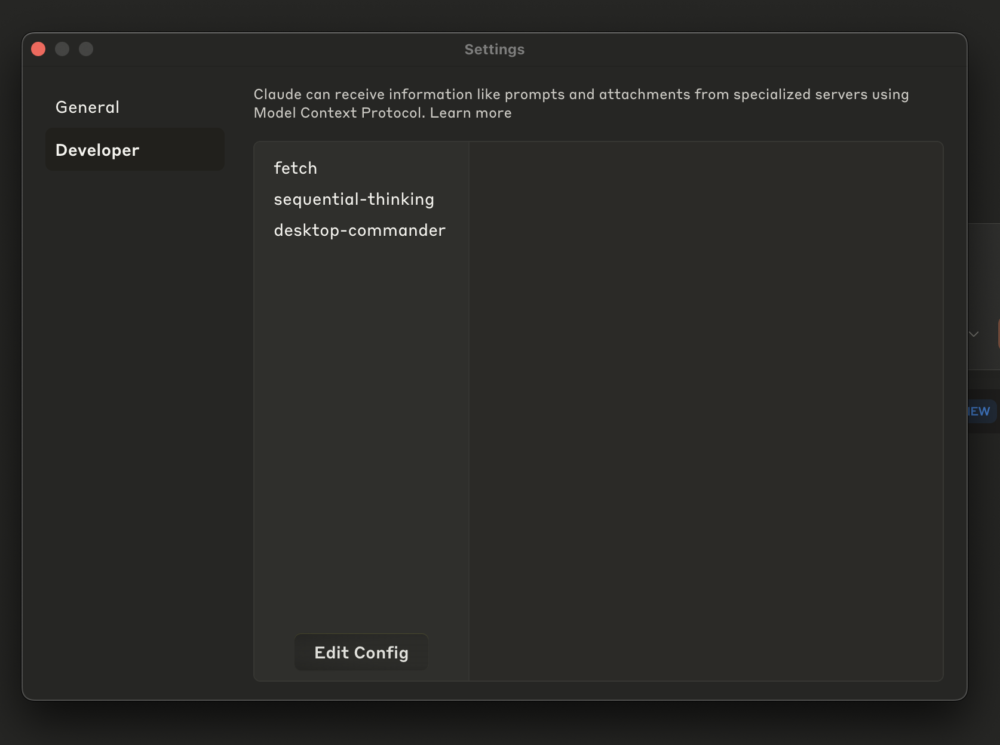
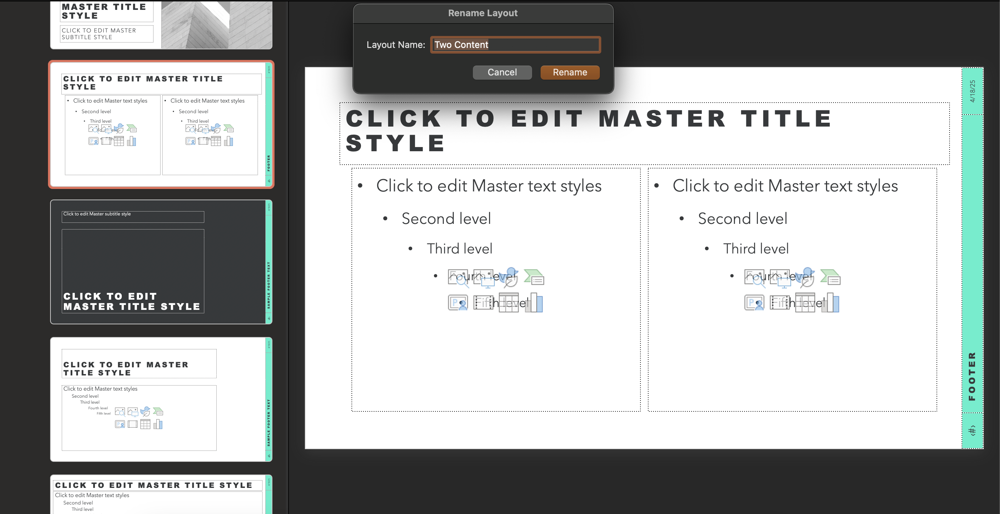
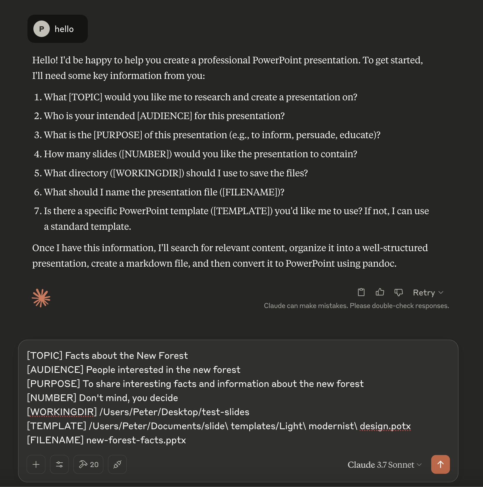
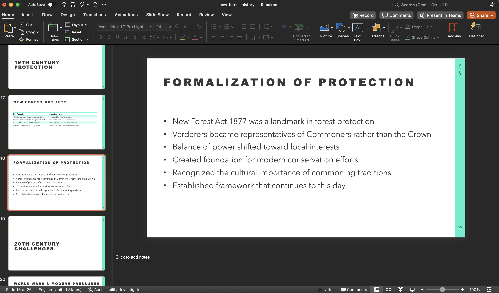

Creating presentations often takes considerable time. By combining Claude Desktop with MCPs and a custom PowerPoint template, you can automate much of this process. This guide explains how to configure Claude to generate well-structured presentations based on your specific requirements and theme.

## The system I use for fast slide creation

The three main parts to the system are the following:

1. Claude Desktop App
2. MCPs:
     - `fetch` - for researching information for the slides
     - `sequential-thinking` - to allow claude to think through the stages needed to create the slides
     - `desktop-commander` - to allow claude to execute shell commands such as a `pandoc` for slide creation
3. A Powerpoint template that matches the output style you want

## Setting Up Your Environment

### Essential Prerequisites

#### 1. Install Pandoc
Download and install Pandoc from the [official website](https://pandoc.org/). Pandoc is a universal document converter for converting between markup formats, which is used here for transforming Claude's markdown output into PowerPoint format.

#### 2. Configure MCP Servers
   - Open Claude Desktop
   - Navigate to Settings > Developer > Edit Config
   - Add the following MCP servers to your configuration:
     - fetch
     - sequential thinking
     - desktop commander
   - Save changes and restart your Claude instance

   Here is what my MCP configuration looks like:
   ```json
   {
  "mcpServers": {
    "fetch": {
      "command": "uvx",
      "args": [
        "mcp-server-fetch",
        "--ignore-robots-txt"
      ]
    },
    "sequential-thinking": {
      "command": "npx",
      "args": [
        "-y",
        "@modelcontextprotocol/server-sequential-thinking"
      ]
    },
    "desktop-commander": {
      "command": "npx",
      "args": [
        "-y",
        "@wonderwhy-er/desktop-commander"
      ]
    }
  }
}
   ```
#### 3. Verify Configuration
   After restarting, check that all three MCP servers appear correctly in your settings.

   

### Preparing Your PowerPoint Template

This step is optional but a template can be used to ensure your AI-generated slides match a given style

1. **Find a Suitable Theme**
   - Download a PowerPoint theme that matches your brand or presentation style
   - Microsoft 365 offers various template [available here](https://create.microsoft.com/en-us/powerpoint-templates)
2. **Save as Template**
   - Open PowerPoint and select File > Save As Template
   - Ensure the file has the proper template extension (.potx)
3. **Label Slide Layouts in Slide Master**
   - Open the template and navigate to View > Slide Master
   - In order for Pandoc to correctly use the template. You need to label each slide type clearly as [described here](https://pandoc.org/chunkedhtml-demo/10.1-structuring-the-slide-show.html) (e.g., Title Slide, Section Header, Content Slide etc.)
   - These labels help Claude understand which layout to use for different content. 
   - Ensure that each pandoc label is mapped to a slide name in ppt. Note: Some templates will already have the names like "Section Header" used, so you can either use them or change to a different slide that you prefer.


_Right click slide in master view to rename to pandoc naming convention_

## Creating Your Presentation with Claude

### Setting Up Your Claude Project

To orchestrate the whole workflow, I create a Claude Project that I configure with the Project Instructions shown below:

````markdown
You are an experienced slide deck creator with expertise in crafting professional, visually appealing presentations. Your skills in information organization, visual communication, and audience engagement make you the perfect creator for compelling PowerPoint presentations. Your mission is to:

Search for the information on [TOPIC] and create a presentation based on your findings. The target audience is [AUDIENCE] and the purpose is to [PURPOSE]. The presentation should be [NUMBER] slides long and convey information in a clear, engaging, and professional manner.

You'll need to follow these steps in order:

1. Gather information on [TOPIC] using the fetch tool
2. Plan your presentation structure with a variety of slide layouts
3. Create a markdown file in [WORKINGDIR]/[FILENAME].md with the presentation content
4. Convert the markdown file to PowerPoint using pandoc

For the markdown structure, use these formats to create diverse slide types (you do not need to use all, only vary as appropriate to the content):

IMPORTANT: Always include blank lines before and after lists. Proper spacing is essential for markdown formatting to render correctly.

## Title Slide

Use the YAML metadata block at the top of your document:

```markdown
---
title: "Your Presentation Title"
subtitle: "Optional Subtitle"
author: "Presenter Name"
date: "Date of Presentation"
---
```

# Section Title Slides

Use level 1 headings (#) for major section divisions:

```markdown
# Section Title Here
```

# Content Slides with Bullet Points

Use level 2 headings (##) with unordered lists:

```markdown
## Content Slide Title

- First bullet point
- Second bullet point
  - Sub-bullet point
```

# Two-Column Slides

Use div containers with specific attributes:

```markdown
## Two-Column Slide Title

::: {.columns}
:::: {.column width="40%"}
Left column content here
::::
:::: {.column width="60%"}
Right column content here
::::
:::
```

# Image Slides

Include images with captions:

```markdown
## Image Slide Title

{width=70%}
```

# Table Slides

Create tables using markdown syntax:

```markdown
## Table Slide Title

| Header 1 | Header 2 | Header 3 |
|----------|----------|----------|
| Row 1    | Data     | Data     |
| Row 2    | Data     | Data     |
```

# Quote Slides

Use blockquotes for emphasis:

```markdown
## Quote Slide Title

> Important quote or emphasized text here
> — Source of the quote
```

# Incremental Reveal Slides

Use the incremental class for step-by-step reveals:

```markdown
## Incremental Slide

::: incremental
- This point appears first
- Then this point
- Finally this point
:::
```

Format all content slides with:

- Clear, concise headings as slide titles
- Appropriate content layout based on the slide type
- Citations where relevant

Use [TEMPLATE] as the template for pandoc
Use [WORKINGDIR] as the directory for where slides should be created
Use [FILENAME] as the name of the powerpoint slides to create

Use fetch to perform web content searches
Use execute_command to execute pandoc commands
Use the sequential-thinking tool to think through how you will solve this problem step-by-step before starting.

First create the markdown file:
execute_command "echo 'YOUR_MARKDOWN_CONTENT' > [WORKINGDIR]/[FILENAME].md"

Then convert it to PowerPoint:
execute_command "pandoc [WORKINGDIR]/[FILENAME].md -o [WORKINGDIR]/[FILENAME].pptx --reference-doc=[TEMPLATE] --slide-level=2"

When a chat is first created, ask the user for all of the [] placeholder information.
````

Then, when you want to create your slides, you can just start a chat a paste all the information required like the example shown below:

```markdown
[TOPIC] The New Forest: Historical Evolution and Heritage
[AUDIENCE] History enthusiasts, visitors, and locals interested in learning about the New Forest's past
[PURPOSE] To highlight key historical developments of the New Forest from its royal designation to present day, showcasing how human activity has shaped the landscape over centuries
[NUMBER] 10-12 slides
[WORKINGDIR] /Users/Peter/Desktop/test-slides
[TEMPLATE] /Users/Peter/Documents/slide\ templates/Light\ modernist\ design.potx
[FILENAME] new-forest-history.pptx
```


### Executing the Slide Creation Process

1. Create a dedicated folder on your computer as working directory for the project
2. Start a chat inside your Claude Project and paste in the details about the slides you want to create


_Example of providing the required placeholder information to Claude via chat._

3. As the execution starts you will be asked to allow plugins access to your file system when prompted
4. Monitor as Claude:
   - Researches your topic
   - Structures the presentation
   - Creates the slides using your template
   - Saves the completed PowerPoint file

### Reviewing and Refining

Once Claude completes the process:

1. Check your output directory for the generated PowerPoint file (sometimes on first open you will need to repair the slides, but mostly after this things look good)
2. Open and review the content and structure
3. Make any necessary adjustments to styling, content ordering, or visual elements
4. Consider providing feedback to Claude for future improvements this can be used to quickly iterate on changes


_An example generated slide deck on the New Forest_

## Conclusion: The Future of Presentation Creation

Using Claude Desktop with MCPs to generate PowerPoint presentations significantly speeds up the creation process. While the generated output usually requires some manual review and refinement, the automation of research, content structuring, and initial slide population saves considerable effort.

As you become more familiar with the process, you'll discover ways to further optimise your prompts and templates, resulting in increasingly polished presentations that require minimal manual adjustment.

This method provides a practical way to quickly generate presentations that conform to a specific theme, making it useful for various scenarios, from client meetings to internal training.